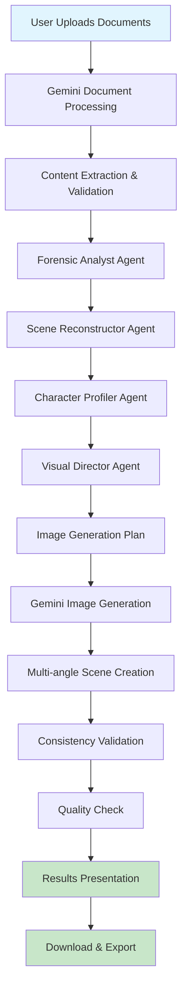

# 🔍 CourtroomViz - Legal Evidence Visualizer

<div align="center">


**Transform Crime Scene Evidence into Detailed Forensic Visualizations**

*Powered by Gemini 2.5 Flash Image Preview*

[](https://python.org)
[](https://streamlit.io)
[](https://crewai.com)
[](https://ai.google.dev)

</div>

---

## 📋 Table of Contents

- [🎯 Overview](#-overview)
- [✨ Key Features](#-key-features)
- [🏗️ Architecture](#️-architecture)
- [🛠️ Technologies Used](#️-technologies-used)
- [📦 Installation](#-installation)
- [🚀 Quick Start](#-quick-start)
- [🔄 End-to-End Flow](#-end-to-end-flow)
- [📊 Flow Diagram](#-flow-diagram)
- [🤖 AI Agents](#-ai-agents)
- [📁 Project Structure](#-project-structure)
- [⚙️ Configuration](#️-configuration)
- [📝 Usage Examples](#-usage-examples)
- [🔧 Advanced Configuration](#-advanced-configuration)
- [🐛 Troubleshooting](#-troubleshooting)
- [🤝 Contributing](#-contributing)
- [📄 License](#-license)

---

## 🎯 Overview

**CourtroomViz** is a revolutionary legal technology platform that transforms complex crime scene evidence into compelling, courtroom-ready visualizations.It leverages cutting-edge AI technologies to help legal professionals present evidence more effectively to juries and judges.

### The Problem
- Legal cases often involve complex evidence that's difficult for juries to understand
- Traditional evidence presentation methods are static and lack visual impact
- Crime scene reconstruction requires specialized expertise and expensive tools
- Maintaining character and scene consistency across multiple visualizations is challenging

### The Solution
CourtroomViz uses a multi-agent AI system powered by CrewAI and Gemini 2.5 Flash to:
- Automatically analyze legal documents and evidence
- Generate detailed forensic visualizations
- Maintain character and scene consistency
- Create compelling visual narratives for courtroom presentation

---

## ✨ Key Features

### 🔍 **Intelligent Evidence Analysis**
- **PDF Processing**: Upload and analyze legal documents, police reports, witness statements
- **Multi-format Support**: PDF, TXT, images, audio, video files
- **Evidence Categorization**: Automatic classification of physical, digital, testimonial, and circumstantial evidence

### 🤖 **Multi-Agent AI System**
- **Forensic Analyst**: Specialized in evidence extraction and categorization
- **Scene Reconstructor**: Expert in 3D spatial analysis and timeline reconstruction
- **Character Profiler**: Maintains visual consistency across all generated scenes
- **Visual Director**: Creates compelling visual narratives for maximum jury impact

### 🎨 **Advanced Image Generation**
- **Multi-angle Generation**: Multiple camera perspectives for comprehensive scene coverage
- **Character Consistency**: Maintains consistent character appearances across all images
- **Professional Quality**: Courtroom-ready visualizations with forensic accuracy
- **Retry Mechanism**: Robust error handling with multiple generation attempts

### 📊 **Comprehensive Analysis**
- **Timeline Reconstruction**: Chronological event sequencing with evidence mapping
- **Spatial Analysis**: Precise measurements and positioning of evidence and people
- **Legal Validation**: Built-in checks for legal accuracy and potential objections
- **Technical Specifications**: Detailed forensic and technical requirements

---

## 🏗️ Architecture

CourtroomViz follows a modular, agent-based architecture designed for scalability and maintainability:

```
┌─────────────────────────────────────────────────────────────┐
│                    Streamlit Frontend                       │
├─────────────────────────────────────────────────────────────┤
│                 Gemini Visualization Engine                 │
├─────────────────────────────────────────────────────────────┤
│                    CrewAI Multi-Agent System                │
│  ┌─────────────┬─────────────┬─────────────┬─────────────┐  │
│  │  Forensic   │    Scene    │ Character   │   Visual    │  │
│  │  Analyst    │Reconstructor│  Profiler   │  Director   │  │
│  └─────────────┴─────────────┴─────────────┴─────────────┘  │
├─────────────────────────────────────────────────────────────┤
│                    Pydantic Data Models                     │
├─────────────────────────────────────────────────────────────┤
│                    Gemini 2.5 Flash API                    │
└─────────────────────────────────────────────────────────────┘
```

---

## 🛠️ Technologies Used

### **Core Technologies**
- **Python 3.8+**: Primary programming language
- **Streamlit**: Web application framework for the user interface
- **CrewAI**: Multi-agent AI framework for specialized legal analysis
- **Pydantic**: Data validation and serialization

### **AI & Machine Learning**
- **Google Gemini 2.5 Flash**: Large language model for text analysis
- **Google Gemini 2.5 Flash Image Preview**: Advanced image generation
- **LangChain**: LLM integration and prompt management
- **Google Embeddings**: Text embedding for semantic analysis

### **Data Processing**
- **Pillow (PIL)**: Image processing and manipulation
- **python-dotenv**: Environment variable management
- **tempfile**: Temporary file handling for document processing

### **Development Tools**
- **pytest**: Testing framework
- **black**: Code formatting
- **flake8**: Linting
- **mypy**: Type checking

---

## 📦 Installation

### Prerequisites
- Python 3.8 or higher
- Google Gemini API key (free at [AI Studio](https://ai.studio/banana))

### Step 1: Clone the Repository
```bash
git clone https://github.com/yourusername/courtroom-viz.git
cd courtroom-viz
```

### Step 2: Create Virtual Environment
```bash
python -m venv venv
source venv/bin/activate  # On Windows: venv\Scripts\activate
```

### Step 3: Install Dependencies
```bash
pip install -r requirements.txt
```

### Step 4: Environment Configuration
Create a `.env` file in the project root:
```bash
touch .env
```

Add your Gemini API key:
```env
GEMINI_API_KEY=your_gemini_api_key_here
```

**Get your free API key at:** https://ai.studio/banana

---

## 🚀 Quick Start

### 1. Start the Application
```bash
streamlit run main.py
```

### 2. Access the Interface
Open your browser and navigate to: `http://localhost:8501`

### 3. Upload Case Documents
- Upload PDF reports, witness statements, or other legal documents
- Or enter case description directly in the text area

### 4. Configure Analysis
- Select case type (Traffic Accident, Crime Scene, etc.)
- Choose visualization style (professional, technical, dramatic, jury_friendly)
- Set quality level and other preferences

### 5. Generate Visualizations
Click "🚀 Generate Crime Scene Visualizations" and wait for the AI analysis to complete.

---

## 🔄 End-to-End Flow

### **Phase 1: Document Processing**
1. **File Upload**: User uploads legal documents (PDF, TXT, images, audio, video)
2. **Content Extraction**: Gemini processes documents and extracts relevant information
3. **Data Validation**: System validates extracted content for completeness

### **Phase 2: AI Agent Analysis**
1. **Forensic Analysis**: Forensic Analyst agent categorizes and analyzes evidence
2. **Scene Reconstruction**: Scene Reconstructor agent creates spatial analysis and timeline
3. **Character Profiling**: Character Profiler agent maintains consistency requirements
4. **Visual Direction**: Visual Director agent creates comprehensive image generation plan

### **Phase 3: Image Generation**
1. **Plan Execution**: System executes the AI-generated image plan
2. **Multi-angle Generation**: Creates multiple camera angles for each scene
3. **Consistency Maintenance**: Ensures character and scene consistency across images
4. **Quality Validation**: Validates generated images for quality and accuracy

### **Phase 4: Presentation**
1. **Results Display**: Shows generated visualizations in an organized grid
2. **Download Options**: Provides download links for each generated image
3. **Analysis Report**: Displays detailed AI analysis results
4. **Courtroom Ready**: Images are formatted for legal presentation

---

## 📊 Flow Diagram



---

## 🤖 AI Agents

### **1. Forensic Analyst Agent**
- **Role**: Senior Forensic Evidence Specialist
- **Expertise**: 20+ years courtroom experience, 500+ cases testified
- **Responsibilities**:
  - Evidence categorization and analysis
  - Technical specification extraction
  - Legal context assessment
  - Chain of custody validation

### **2. Scene Reconstructor Agent**
- **Role**: Expert Crime/Accident Scene Reconstruction Specialist
- **Expertise**: 15+ years, 300+ high-profile cases
- **Responsibilities**:
  - 3D spatial reconstruction
  - Timeline analysis
  - Environmental factor assessment
  - Technical accuracy validation

### **3. Character Profiler Agent**
- **Role**: Master Character Consistency and Visual Identity Specialist
- **Expertise**: 12+ years in character design and visual storytelling
- **Responsibilities**:
  - Character profile creation
  - Visual consistency maintenance
  - Object specification management
  - Legal accuracy validation

### **4. Visual Director Agent**
- **Role**: Award-Winning Courtroom Visual Presentation Director
- **Expertise**: 18+ years, Emmy-winning documentary filmmaker
- **Responsibilities**:
  - Visual narrative design
  - Image sequence planning
  - Technical requirement specification
  - Jury engagement optimization

---

## 📁 Project Structure

```
courtroom-viz/
├── 📁 src/
│   └── 📁 courtroom_viz/
│       ├── 📄 __init__.py
│       ├── 📄 crew.py              # CrewAI multi-agent system
│       ├── 📄 models.py            # Pydantic data models
│       └── 📁 config/
│           ├── 📄 agents.yaml      # Agent configurations
│           └── 📄 tasks.yaml       # Task definitions
├── 📁 testCase/                    # Sample case files
│   ├── 📄 police_report.txt
│   ├── 📄 call-transcript.txt
│   └── 📄 witness_statements/
├── 📁 Documentation/               # CrewAI documentation
├── 📁 codeDocuments/              # Technical documentation
├── 📄 main.py                     # Streamlit application
├── 📄 requirements.txt            # Python dependencies
├── 📄 pyproject.toml             # Project configuration
├── 📄 .env                       # Environment variables
└── 📄 README.md                  # This file
```

---

## ⚙️ Configuration

### **Agent Configuration** (`src/courtroom_viz/config/agents.yaml`)
Each agent has specialized configurations:
- **Role**: Professional role and expertise
- **Goal**: Specific objectives
- **Backstory**: Experience and credentials
- **LLM**: Model configuration
- **Settings**: Verbose mode, delegation, memory

### **Task Configuration** (`src/courtroom_viz/config/tasks.yaml`)
Detailed task definitions with:
- **Description**: Comprehensive task requirements
- **Expected Output**: Pydantic model specifications
- **Context**: Dependencies between tasks
- **Agent Assignment**: Which agent handles each task

### **Environment Variables** (`.env`)
```env
GEMINI_API_KEY=your_api_key_here
```

---

## 📝 Usage Examples

### **Example 1: Crime Scene Analysis**
```python
# Upload police report and witness statements
# Select "Crime Scene" case type
# Choose "professional" visualization style
# Generate comprehensive scene reconstruction
```

### **Example 2: Traffic Accident Reconstruction**
```python
# Upload accident report and photos
# Select "Traffic Accident" case type
# Choose "technical" visualization style
# Generate multi-angle accident reconstruction
```

### **Example 3: Personal Injury Case**
```python
# Upload medical reports and incident documentation
# Select "Personal Injury" case type
# Choose "jury_friendly" visualization style
# Generate clear, understandable visualizations
```

---

## 🔧 Advanced Configuration

### **Custom Evidence Types**
```python
advanced_config = {
    'evidence_types': ['Physical Evidence', 'Digital Evidence', 'Expert Analysis'],
    'focus_areas': ['Scene Layout', 'Character Actions', 'Timeline Sequence'],
    'custom_prompt': 'Focus on DNA evidence and blood spatter analysis'
}
```

### **Visualization Styles**
- **Professional**: Photorealistic, forensic documentation style
- **Technical**: Precise measurements, scientific accuracy
- **Dramatic**: Cinematic angles, emotional impact
- **Jury Friendly**: Clear, simplified representation

### **Quality Settings**
- **Quality Level**: 1-10 slider for generation quality
- **Include Measurements**: Toggle forensic measurements
- **Expert Review Mode**: Enhanced validation and analysis

---

## 🐛 Troubleshooting

### **Common Issues**

#### **1. API Key Error**
```
Error: GEMINI_API_KEY not found in environment variables
```
**Solution**: Ensure `.env` file exists with valid API key

#### **2. Image Generation Fails**
```
Error: No image generated after 3 attempts
```
**Solution**: Check API quota, try different prompt styles, verify case data quality

#### **3. Analysis Validation Fails**
```
Error: Analysis validation failed
```
**Solution**: Ensure case data is comprehensive, check document quality

#### **4. Memory Issues**
```
Error: CrewAI memory system causing excessive API calls
```
**Solution**: Memory system is disabled by default, this is expected behavior

### **Debug Mode**
Enable verbose logging by setting `verbose=True` in agent configurations.

### **Log Files**
- `courtroom_viz_analysis.log`: CrewAI execution logs
- `courtroom_viz_errors.log`: Error tracking and debugging

---

## 🤝 Contributing

We welcome contributions! Please follow these steps:

1. **Fork the repository**
2. **Create a feature branch**: `git checkout -b feature/amazing-feature`
3. **Commit changes**: `git commit -m 'Add amazing feature'`
4. **Push to branch**: `git push origin feature/amazing-feature`
5. **Open a Pull Request**

### **Development Setup**
```bash
# Install development dependencies
pip install -e ".[dev]"

# Run tests
pytest

# Format code
black src/ main.py

# Lint code
flake8 src/ main.py

# Type checking
mypy src/ main.py
```

---

## 📄 License

This project is licensed under the MIT License - see the [LICENSE](LICENSE) file for details.

---

This project leverages the revolutionary capabilities of Gemini 2.5 Flash Image Preview to create a groundbreaking legal technology platform. The combination of multi-agent AI systems, advanced image generation, and legal domain expertise makes CourtroomViz a powerful tool for modern legal practice.

### **Key Innovation Points**
- **First-of-its-kind**: Multi-agent AI system for legal visualization
- **Advanced Technology**: Gemini 2.5 Flash Image Preview integration
- **Professional Quality**: Courtroom-ready output with forensic accuracy
- **Scalable Architecture**: Modular design for easy extension and maintenance

---

<div align="center">

*Transforming Legal Practice Through AI-Powered Visualization*

[](https://github.com/yourusername/courtroom-viz)
[](https://github.com/yourusername/courtroom-viz/issues)
[](https://github.com/yourusername/courtroom-viz/discussions)

</div>